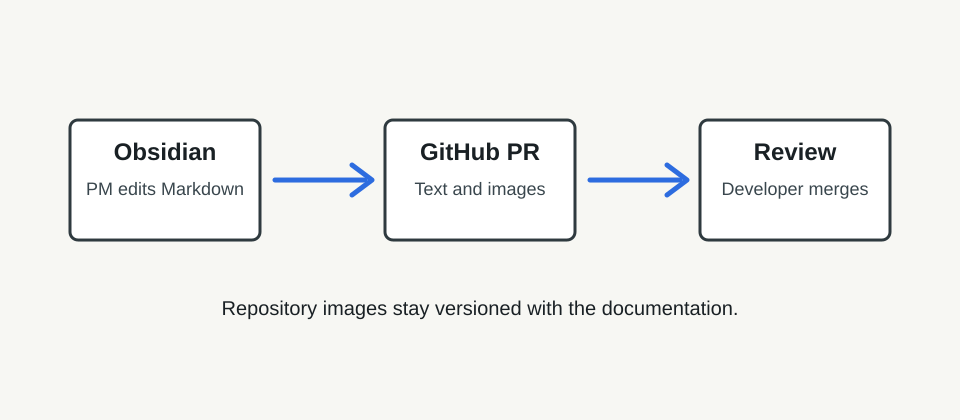

# Product Documentation Test

Welcome to the test documentation repository.

This page links to a simple feature note:

- [Checkout Flow](checkout-flow.md)

Here is a local image stored in the repository:

## What this test proves

- PMs can edit Markdown files in Obsidian.
- Images can live in `docs/assets`.
- A pull request can include both text changes and image files.

